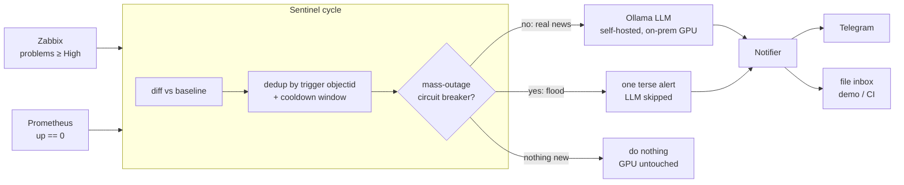

# Sentinel — LLM-in-the-loop infrastructure watchdog

> Polls Zabbix and Prometheus, and **only when something is genuinely new** hands a JSON
> snapshot to a self-hosted LLM to reason about impact and draft a concise operator alert —
> then notifies. Quiet by design: the GPU is touched only when there is real news.


-6E56CF)

Most alerting stacks are either dumb (forward every raw trigger and drown the operator) or
expensive (pipe everything to a cloud LLM). Sentinel is the middle path: cheap, local polling
does the detection, and a **self-hosted** LLM is invoked *only on the delta* to turn a pile of
raw triggers into one human-readable, impact-aware message. Detection is free and constant;
reasoning is rare and local. Zero cloud egress, and in steady state the GPU sees **0 calls/hour**.

The parts worth reading are the **guardrails** that keep it from being noisy or wasteful:
baseline seeding, dedup-with-cooldown, a mass-outage circuit breaker, and no-fallback retry
semantics. They are pure functions in [`sentinel/watchdog.py`](sentinel/watchdog.py) and are
exhaustively unit-tested.

## Architecture



Data flows one way: the two monitoring sources are diffed against persisted state, the delta
runs the guardrail gauntlet, and only survivors reach the LLM and the operator.

## Quickstart

```bash
cp .env.example .env          # demo defaults already point at the bundled mocks
docker compose up --build     # sentinel + mock Zabbix + mock Prometheus + mock Ollama
```

First cycle **seeds a baseline** and sends a one-time "on watch" message — no alert spam for
pre-existing problems. Then, in another terminal, drive a scenario:

```bash
./demo.sh new-problem     # inject a new High problem → LLM reasons → alert appears
./demo.sh mass-outage     # inject a flood → circuit breaker fires one terse alert, LLM skipped
./demo.sh inbox           # read the alerts the notifier wrote (data/inbox.jsonl)
```

In the demo the LLM and notifier are mocked (canned-but-coherent analysis, file-based inbox).
Point `OLLAMA_URL` at a real Ollama and set `NOTIFIER=telegram` to run it for real.

## How it works — the guardrails

These are the design decisions that keep Sentinel useful instead of noisy:

- **Baseline seeding (no alerts on startup).** The first cycle records everything that is
  *already* broken as the baseline and raises nothing. You are not paged for problems that
  predate the watchdog.
- **Diff vs baseline.** Only the change set (new problems, recoveries) is ever a candidate for
  an alert. A steady state produces zero LLM calls.
- **Dedup by trigger `objectid` + cooldown.** A flapping trigger emits a *new* event id every
  cycle, so naive "is this event id new?" logic re-alerts forever. Sentinel keys "did we already
  alert on this?" on the stable trigger `objectid` and suppresses re-alerts within a cooldown
  window (`DEDUP_COOLDOWN_SEC`). One flapping port = one alert, not one per cycle.
- **Mass-outage circuit breaker.** If a single cycle brings a flood of new problems
  (`MASS_OUTAGE_THRESHOLD`, default 8) — the signature of a core/power failure — Sentinel does
  **not** ask the LLM per event or fan out messages. It short-circuits to one terse "possible
  mass outage, check Zabbix/Grafana" alert, so a big outage can't turn into a pager storm.
- **No-fallback retry semantics.** There is deliberately no "send it raw if the LLM is down."
  If the GPU is unreachable, the cycle raises and aborts, and **state is not advanced** — so the
  same event is picked up and retried on the next cycle. An operator alert is either LLM-reasoned
  or it doesn't go out. Nothing is lost, nothing is sent un-reasoned.
- **Cost / energy aware.** Detection (Zabbix + Prometheus polling) is local and free and runs
  every cycle; the GPU is only woken when there is actual news that survives the guardrails.
- **HTML-with-plain-text fallback** on the Telegram channel: if the Bot API rejects the message
  HTML, it is stripped and re-sent as plain text so an alert is never silently dropped.

## Configuration

| Variable | Default | Description |
|---|---|---|
| `ZABBIX_URL` | — | Zabbix JSON-RPC endpoint (`.../api_jsonrpc.php`) |
| `ZABBIX_USER` / `ZABBIX_PASS` | `monitor` | Zabbix credentials |
| `ZABBIX_MIN_SEVERITY` | `4` | Minimum severity to consider (4 = High, 5 = Disaster) |
| `PROMETHEUS_URL` | — | Prometheus base URL (`/api/v1/query` is appended) |
| `OLLAMA_URL` | — | Self-hosted Ollama base URL |
| `OLLAMA_MODEL` | `qwen2.5:14b` | Any Ollama model, sized to your GPU |
| `OLLAMA_TIMEOUT` | `300` | LLM request timeout (seconds) |
| `NOTIFIER` | `inbox` | `inbox` (file + stdout, for demo/CI) or `telegram` |
| `TELEGRAM_TOKEN` / `TELEGRAM_CHAT_ID` | — | Required when `NOTIFIER=telegram` |
| `INBOX_PATH` | `./data/inbox.jsonl` | Where the inbox notifier writes |
| `DEDUP_COOLDOWN_SEC` | `60` | Cooldown window for the same trigger |
| `MASS_OUTAGE_THRESHOLD` | `8` | New problems in one cycle that trip the breaker |
| `STATE_FILE` | `./data/state.json` | Persisted baseline + cooldown clock |

## Demo / what you'll see

Running `docker compose up` then `./demo.sh new-problem` produces an inbox entry like:

```
======================================================================
[sentinel] ALERT (written to inbox: /data/inbox.jsonl)
----------------------------------------------------------------------
Sentinel · 2026-01-01 12:00

New: switch-access-07 reports Gi1/0/24 link down (High).
Likely impact: devices behind that access port lost connectivity...
First look: check whether Gi1/0/24 is an uplink or an edge port...
======================================================================
```

`./demo.sh mass-outage` instead produces a single `🚨 Possible mass outage: N new problems`
message with the LLM skipped — the circuit breaker in action.

## Testing

```bash
pip install -e ".[dev]"
ruff check .
pytest -q
```

The guardrail logic (dedup, cooldown, circuit breaker, baseline diff) is pure and covered by
unit tests in [`tests/`](tests/). CI runs ruff + pytest on every push.

## Tech stack

- **Python 3.10+**, standard library only at runtime (no pip deps) — deploys to a locked-down
  monitoring host with just `python3`.
- **Ollama** for self-hosted LLM inference (any model; demo defaults to `qwen2.5:14b`).
- **Docker Compose** for the end-to-end demo; **systemd timer** for production
  (see [`docs/systemd-deploy.md`](docs/systemd-deploy.md)).
- **ruff** + **pytest**, GitHub Actions CI.

## Context

Built as a generic reference implementation inspired by a production monitoring watchdog running
at a national telecom operator. All hosts, IPs, tokens and topology in this repo are fictional.

## License

MIT © 2026 Marcelo Semino
