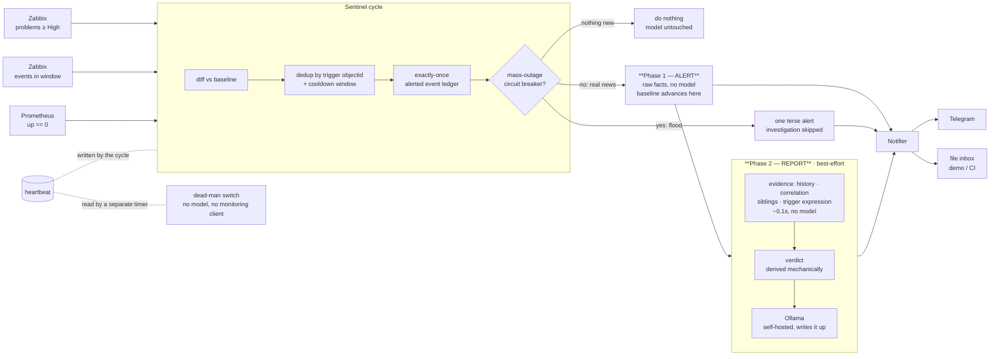

# Sentinel — LLM-in-the-loop infrastructure watchdog

> Polls Zabbix and Prometheus and, **only when something is genuinely new**, alerts in
> seconds from raw facts — then investigates and follows up with a report. The model is
> never on the critical path of the notification, and never touched at all unless there is
> real news.


-6E56CF)

Most alerting stacks are either dumb (forward every raw trigger and drown the operator) or
expensive (pipe everything to a cloud LLM). Sentinel is the middle path: cheap, local polling
does the detection, and a **self-hosted** model is invoked *only on the delta* to turn a pile
of raw triggers into something an operator can act on. Detection is free and constant;
reasoning is rare and local. Zero cloud egress, and in steady state the model is called
**0 times per hour**.

The parts worth reading are the **guardrails** that keep it from being noisy, wasteful or
late: baseline seeding, dedup-with-cooldown, a mass-outage circuit breaker, an event window
with exactly-once delivery, and a two-phase cycle where the alert never waits for the model.
They are pure functions in [`sentinel/watchdog.py`](sentinel/watchdog.py) and are exhaustively
unit-tested.

If you only read one section, read [What changed in v2, and why](#what-changed-in-v2-and-why):
it is a design decision this README used to defend, reversed by a measurement.

## Architecture


```mermaid
flowchart LR
    ZBX[Zabbix<br/>problems ≥ High] --> W
    ZBXW[Zabbix<br/>events in window] --> W
    PROM[Prometheus<br/>up == 0] --> W

    subgraph W[Sentinel cycle]
        direction TB
        DIFF[diff vs baseline] --> DEDUP[dedup by trigger objectid<br/>+ cooldown window]
        DEDUP --> ONCE[exactly-once<br/>alerted event ledger]
        ONCE --> CB{mass-outage<br/>circuit breaker?}
    end

    CB -- "nothing new" --> QUIET[do nothing<br/>model untouched]
    CB -- "yes: flood" --> TERSE[one terse alert<br/>investigation skipped]
    CB -- "no: real news" --> P1

    P1[**Phase 1 — ALERT**<br/>raw facts, no model<br/>baseline advances here] --> NOTIFY
    P1 --> P2
    subgraph P2[**Phase 2 — REPORT** · best-effort]
        direction TB
        EV[evidence: history · correlation<br/>siblings · trigger expression<br/>~0.1s, no model] --> V[verdict<br/>derived mechanically]
        V --> LLM[Ollama<br/>self-hosted, writes it up]
    end
    P2 --> NOTIFY
    TERSE --> NOTIFY
    NOTIFY[Notifier] --> TG[Telegram]
    NOTIFY --> INBOX[file inbox<br/>demo / CI]

    HB[(heartbeat)] -.written by the cycle.- W
    HB -.read by a separate timer.- DM[dead-man switch<br/>no model, no monitoring client]
```

Data flows one way, and the diagram has one load-bearing property: **nothing in Phase 2 can
reach back into Phase 1.** The alert has been delivered and the baseline has advanced before
the evidence layer or the model is touched, so everything to the right of that box can fail
without costing the operator a notification.

## Quickstart

```bash
cp .env.example .env          # demo defaults already point at the bundled mocks
docker compose up --build     # sentinel + mock Zabbix + mock Prometheus + mock Ollama
```

First cycle **seeds a baseline** and sends a one-time "on watch" message — no alert spam for
pre-existing problems. Then, in another terminal, drive a scenario:

```bash
./demo.sh new-problem     # a new High problem → ALERT in seconds, then REPORT
./demo.sh transient       # an incident that opened AND closed between rounds
./demo.sh slow-model      # the model stalls 30s → the ALERT still goes out immediately
./demo.sh break-model     # the model 500s → ALERT, then "investigation failed". Never silence.
./demo.sh mass-outage     # a flood → circuit breaker fires one terse alert, model skipped
./demo.sh inbox           # read the alerts the notifier wrote (data/inbox.jsonl)
```

In the demo the model and notifier are mocked (canned-but-coherent analysis, file-based inbox).
Point `OLLAMA_URL` at a real Ollama and set `NOTIFIER=telegram` to run it for real.

## How it works — the guardrails

These are the design decisions that keep Sentinel useful instead of noisy:

- **Baseline seeding (no alerts on startup).** The first cycle records everything that is
  *already* broken as the baseline and raises nothing. You are not paged for problems that
  predate the watchdog.
- **Diff vs baseline.** Only the change set (new problems, recoveries) is ever a candidate for
  an alert. A steady state produces zero model calls.
- **Dedup by trigger `objectid` + cooldown.** A flapping trigger emits a *new* event id every
  cycle, so naive "is this event id new?" logic re-alerts forever. Sentinel keys "did we already
  alert on this?" on the stable trigger `objectid` and suppresses re-alerts within a cooldown
  window (`DEDUP_COOLDOWN_SEC`). One flapping port = one alert, not one per cycle.
- **Mass-outage circuit breaker.** If a single cycle brings a flood of new problems
  (`MASS_OUTAGE_THRESHOLD`, default 8) — the signature of a core/power failure — Sentinel does
  **not** investigate per event or fan out messages. It short-circuits to one terse "possible
  mass outage, check Zabbix/Grafana" alert, so a big outage can't turn into a pager storm.
- **Event window with exactly-once.** The active-problem query answers *"what is broken now"*,
  so an incident that opens and closes between two rounds is invisible to it — the monitoring
  system recorded it perfectly and the watchdog never saw it. A second query asks for *events
  in a time range*, the ranges deliberately overlap so nothing can fall between them, and a
  ledger of alerted event ids is what stops the overlap from alerting twice. The lookback is
  capped, so coming back from a weekend of downtime does not replay the weekend.
- **Delivery is never degraded, only enrichment.** The alert is sent from raw facts, without
  the model, and the baseline advances with it. Everything after that point is best-effort.
  See [What changed in v2](#what-changed-in-v2-and-why) — this reverses a v1 decision.
- **Cost / energy aware.** Detection (Zabbix + Prometheus polling) is local and free and runs
  every cycle; the model is only woken when there is actual news that survives the guardrails.
- **HTML-with-plain-text fallback** on the Telegram channel: if the Bot API rejects the message
  HTML, it is stripped and re-sent as plain text so an alert is never silently dropped.

## What changed in v2, and why

v1 ran `detect → reason → notify`, and persisted state only after the whole pipeline
succeeded. That bought a clean retry guarantee, and this README argued for the consequence as
a feature:

> *No-fallback retry semantics. There is deliberately no "send it raw if the LLM is down." If
> the GPU is unreachable, the cycle raises and aborts, and state is not advanced [...] An
> operator alert is either LLM-reasoned or it doesn't go out.*

The argument is coherent. It also put the model on the critical path of the notification, and
nobody had priced that, because on the hardware in the design document the model answers in
seconds.

Then it got measured. On the deployment this repository is the sanitized version of, one call
to the local model — a 30B MoE running CPU-only — took **9 minutes**. On a 15-minute round
that is an alert arriving up to half an hour after a three-minute outage. The decision was
right about what it optimised for and wrong about what mattered: an operator would rather know
something broke and get the analysis two minutes later than get a well-argued paragraph about
an outage that has already ended.

> **Where that number comes from.** It is from the incident log of the production system, not
> from this repository, and **nothing here reproduces it** — there is no timing artefact in
> `runs/` and this README will not pretend otherwise. What is reproducible here is the
> consequence: `tests/test_e2e_two_phase.py` stalls the model by 30 s and asserts the alert
> goes out anyway. The architecture does not depend on the exact figure, only on the model
> being slow enough to matter, which on CPU it reliably is.

So the ordering changed, and the two phases now carry different guarantees:

| Phase | Message | Guarantee |
|---|---|---|
| **1 — ALERT** | Raw facts from monitoring | **Load-bearing.** No model. The baseline advances *here*: if delivery fails it does not advance, and the next round retries. Nothing is lost. |
| **2 — REPORT** | The investigation | **Best-effort.** If it fails, a short message says so. Never silent, never holds the alert back. |

The policy was in the design notes from the beginning — *degrade the enrichment, never the
delivery*. v2 is where it became true of the code instead of only of the prose.

Three things followed from the reordering:

**The model stopped investigating.** Once the alert no longer waits, there is time to do
actual work before the prompt — so [`sentinel/evidence.py`](sentinel/evidence.py) collects
four bounded read-only queries in about a tenth of a second, no model involved: how long the
item was actually failing and at what sample cadence, what else moved in the same window,
which reachability checks on the host's most specific group failed **and which kept
answering**, and the expanded trigger expression. That third one is the one worth arguing
for: *"wired and wireless died together"* points upstream, *"HTTP kept answering while ICMP
and DNS died"* points at a protocol. **The checks that did not fail narrow the hypothesis as
much as the ones that did**, and a collector that only gathers failures can never produce the
second sentence.

**The conclusions stopped being homework.** The first real report was ~3200 characters — the
four blocks dumped raw. "Nobody reads all that" was correct, and an alert that is not read has
not alerted. The instinct is to call that a formatting problem; it was a division-of-labour
problem. The code gathered raw material and left the synthesis to somebody else: the operator
at 3 AM, or the model. The model did it badly, which is expected — it was being asked to
re-derive arithmetic it had been handed. The conclusions are mechanically derivable from those
same four blocks, so [`sentinel/verdict.py`](sentinel/verdict.py) derives them, and the model
gets them as input rather than as a task.

**Something had to watch the watchdog.** Every guardrail above is about not alerting too much.
None of them can fire when the process stops running, and that failure is silent by
construction: a quiet channel is also what a healthy day looks like. So the cycle writes a
heartbeat and a **separate** unit on its own timer reads it
([`sentinel/deadman.py`](sentinel/deadman.py)). The separation is the design — it imports no
monitoring client and never calls the model, because the moment it shares either, the two die
together and it stops being a check.

Run `./demo.sh slow-model` or `./demo.sh break-model` to watch the difference: the alert
arrives either way.

## Configuration

| Variable | Default | Description |
|---|---|---|
| `ZABBIX_URL` | — | Zabbix JSON-RPC endpoint (`.../api_jsonrpc.php`) |
| `ZABBIX_USER` / `ZABBIX_PASS` | `monitor` | Zabbix credentials |
| `ZABBIX_MIN_SEVERITY` | `4` | Minimum severity to consider (4 = High, 5 = Disaster) |
| `PROMETHEUS_URL` | — | Prometheus base URL (`/api/v1/query` is appended) |
| `OLLAMA_URL` | — | Self-hosted Ollama base URL |
| `OLLAMA_MODEL` | `qwen2.5:14b` | Any Ollama model, sized to the hardware you actually have — which may well be a CPU, and that is the case v2 was designed around |
| `OLLAMA_TIMEOUT` | `300` | Model request timeout (seconds). On CPU this needs to be generous; nothing waits on it |
| `NOTIFIER` | `inbox` | `inbox` (file + stdout, for demo/CI) or `telegram` |
| `TELEGRAM_TOKEN` / `TELEGRAM_CHAT_ID` | — | Required when `NOTIFIER=telegram` |
| `INBOX_PATH` | `./data/inbox.jsonl` | Where the inbox notifier writes |
| `DEDUP_COOLDOWN_SEC` | `60` | Cooldown window for the same trigger |
| `MASS_OUTAGE_THRESHOLD` | `8` | New problems in one cycle that trip the breaker |
| `EVENT_WINDOW_MAX_SEC` | `21600` | How far back a window may ever reach. Covers a skipped round; caps the replay after a long outage |
| `EVIDENCE_WINDOW_SEC` | `900` | How much history around the event the evidence layer looks at |
| `SIBLINGS_MAX_HOSTS` | `8` | Ceiling on hosts queried when checking the neighbours |
| `SIBLINGS_MAX_ITEMS` | `12` | Ceiling on items, so a large group cannot become a sweep |
| `HEARTBEAT_FILE` | `./data/heartbeat.json` | Written by the cycle, read by the dead-man timer |
| `HEARTBEAT_MAX_AGE_SEC` | `600` | Age at which the dead-man switch fires. Set it above your round interval, not equal to it |
| `STATE_FILE` | `./data/state.json` | Persisted baseline, cooldown clock and alerted-event ledger |

The state file is upgraded in place: a v1 file loads under v2 with an empty ledger, so
deploying does not mean deleting state and re-seeding a baseline.

## Demo / what you'll see

Running `docker compose up` then `./demo.sh new-problem` produces an inbox entry like:

```
======================================================================
[sentinel] ALERT (written to inbox: /data/inbox.jsonl)          <- phase 1, no model
----------------------------------------------------------------------
🚨 Sentinel — ALERT · 2026-01-01 12:00

• Interface Gi1/0/24: link down on switch-access-07 (High, since 2026-01-01 11:58)
======================================================================

======================================================================
[sentinel] ALERT (written to inbox: /data/inbox.jsonl)          <- phase 2, best-effort
----------------------------------------------------------------------
🔎 Sentinel — REPORT · 2026-01-01 12:00

Lasted 1m15s — 6 samples every 15s.
Split result: 2 checks failed (ICMP ping) while 1 kept answering (HTTP service
check). Whatever broke did not take the whole path with it.
Trigger expression: last(/switch-access-03/icmpping)=0 (priority 5).

<the model's write-up follows, built on the lines above rather than instead of them>
======================================================================
```

The first block is the one that matters operationally: it was written before the model was
contacted, and it would have been written even if the model had never answered. The three
lines at the top of the second block were derived from the evidence without a model too —
what the model adds is impact and a first thing to look at.

`./demo.sh mass-outage` instead produces a single `🚨 Possible mass outage: N new problems`
message with the model skipped — the circuit breaker in action.

The scenarios worth running are the two that would have produced nothing under v1:

```bash
./demo.sh transient      # an incident that opened and closed between rounds
./demo.sh break-model    # ALERT arrives, then "investigation failed". Never silence.
```

## Testing

```bash
pip install -e ".[dev]"
ruff check .
pytest -q                # 58 tests
```

Two layers, deliberately.

**Pure functions** — the guardrails, the event window, the evidence layer and the verdict are
all pure, so they are tested exhaustively and directly. The interesting cases are the ones
where a reasonable-looking choice quietly breaks the mechanism: a ledger pruned earlier than
the widest window (an old event comes back as new), a cadence computed as a mean (one missing
sample reports a rate the poller never had), "no heartbeat file yet" read as "give it time"
(a watchdog that never started after a deploy goes unnoticed).

**End to end** ([`tests/test_e2e_two_phase.py`](tests/test_e2e_two_phase.py)) — the property
the rewrite exists for belongs to the *ordering*, and ordering cannot be unit-tested. Those
tests boot the three mocks as separate processes on ephemeral ports and drive real cycles over
HTTP: a stalled model must not delay the alert, a broken model must not suppress it, an
incident that opened and closed between rounds must still be reported, and the overlapping
window must not report it twice.

CI runs ruff + pytest on every push.

## Tech stack

- **Python 3.10+**, standard library only at runtime (no pip deps) — deploys to a locked-down
  monitoring host with just `python3`.
- **Ollama** for self-hosted LLM inference (any model; demo defaults to `qwen2.5:14b`).
- **Docker Compose** for the end-to-end demo; **systemd timers** for production — two of them,
  one for the cycle and a separate one for the dead-man switch
  (see [`docs/systemd-deploy.md`](docs/systemd-deploy.md)).
- **ruff** + **pytest**, GitHub Actions CI.

## Context

A generic reference implementation of a monitoring watchdog that runs in production at a
national telecom operator. All hosts, IPs, tokens, credentials and topology in this repository
are fictional; what is real is the architecture and the reasoning behind it, including the
measurement that forced the v2 rewrite.

The v1 → v2 story is the useful part of this repo, and it is deliberately told with the
original argument quoted rather than quietly edited out. A design decision that was defended
in writing and then reversed by a number is worth more as a record than as a clean history.

## License

MIT © 2026 Marcelo Semino
